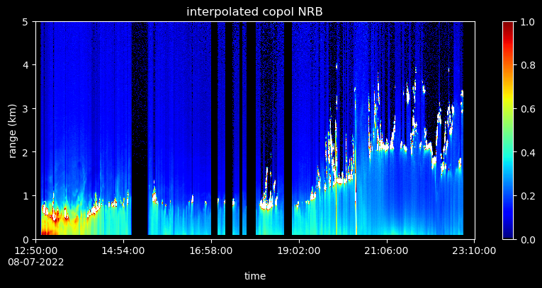

[](https://opensource.org/licenses/MIT)
[](https://www.python.org/downloads/release/python-3916/)

# MPyLab
Python toolkit for reading, plotting, and analyzing Micropulse Lidar data. Pronounce as Am-p-lab

This toolkit took inspiration from peterkuma's project: https://github.com/peterkuma/mpl2nc which can read .mpl binary files and output netcdf files.

This project is currently under development by Bo Chen at Dr. Sarah Brooks Lab, Atmospheric Sciences Department, Texas A&M University.

## Development Plan:
Note: the code is still in development and not well tested.

- pympl.py: Reading, Processing, and Interpolating .mpl data (**In development**)
  - [x] Reading .MPL binary data files.
  - [x] Reading afterpulse, overlap, and deadtime correction .bin files.
  - [x] Function for interpolating lidar data to even timesteps and fill in NaN in any time timestamps.
  - [x] Data selection based on start-time and end-time.
  - [x] Calculate SNR, R2 corrected, NRB, and Depol Ratio
  - [x] Output .MPL binary data (useful when need to combine or make modification to the binary data files)
  - [ ] Output NetCDF data files 
  - [ ] PBL, cloud, and aerosol layer detection based on the zero crossing algorithm.
        
- inversempl.py: Lidar inversion module (**In development, Experimental**)
  - [x] Fernald method
  - [ ] Detect unstability during inversion
  - [ ] Use radiosonde data with Fernald method
    
- plotmpl.py: Ploting mpl data
  - [x] Function for 2d timeseries plot
  - [ ] Function for 1d timeseries plot
  - [ ] Function for single and average profile plot

- mpl_aerosol.py: Aerosol profile retrieval based on MPL data (**Planned**)
- T-matrix calculaiton dataset for lidar aerosol retrieval (**Planned**)

## Documentation

- [Wikipage](https://github.com/bochens/MPyLab/wiki)

#### Micropulse Lidar data reading and processing
- [`PyMPL` class](https://github.com/bochens/MPyLab/wiki/pympl.PyMPL-Class)

#### Micropulse Lidar data visualization
- [`plotmpl` module](https://github.com/bochens/MPyLab/wiki/plotmpl)

## Example Usage

Here's an example usage of the `plot_mpl_2d_timeseries` function:

```python
from pympl import PyMPL
import plotmpl
import matplotlib.pyplot as plt
import numpy as np

# Specify input file path
mpl_file_path = '/Path/to/mpl-folder'
ap_file_path  = '/Path/to/afterpulse-file.bin'
ov_file_path  = '/Path/to/overlap-file.bin'
dt_file_path  = '/Path/to/deadtime-file.bin'

# Create a MPL data object. All the basic corrections and calculations (like NRB) is done at the initialization of the MPL data object
mpl_object = PyMPL(mpl_file_path, ap_file_path, ov_file_path, dt_file_path)

# Peform interpolation over user specified datetime
mpl_object.interpolate_data(60, start_time = np.datetime64('YYYY-MM-DDThh:mm:ss'), end_time = np.datetime64('YYYY-MM-DDThh:mm:ss')) # here uses 60 seconds as interpolation time resolution

# Plot the non-interpolated copol nrb data using default colormap
fig0, ax0 = plt.subplots(nrows=1, ncols=1, figsize=(10,4))
plotmpl.plot_mpl_2d_timeseries(mpl_object.datetime, mpl_object.range_edges, mpl_object.nrb_copol, fig=fig0, ax=ax0, range_max = 5, vmin=0, vmax=1)
ax0.set_title('copol nrb')

# Plot the interpolated copol nrb data using modified gist_ncar colormap
fig1, ax1 = plt.subplots(nrows=1, ncols=1, figsize=(10,4))
plotmpl.plot_mpl_2d_timeseries(mpl_object.interpolated_datetime, mpl_object.range_edges, mpl_object.interpolated_nrb_copol, fig=fig1, ax=ax1, range_max = 5, vmin=0, vmax=1, color_map = plotmpl.lidar_gist)
ax1.set_title('interpolated copol nrb')

plt.show()
```


## Example Gallery

|  | 
|:--:| 
| *NRB data collected during DOE TRACER project by TAMU mobile lab. The gaps show when lidar was off and the gaps in timestamps are handled by the interpolation function.* |
